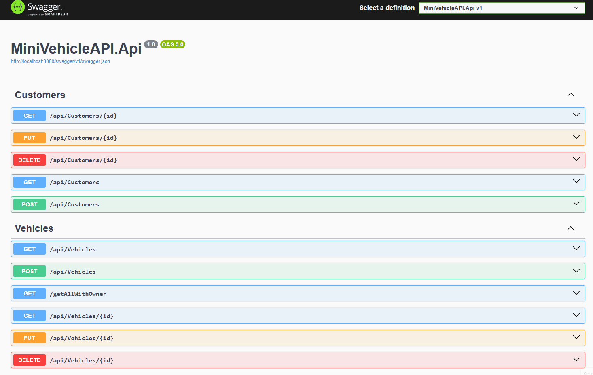

# MiniVehicleAPI

Eine REST API zur Fahrzeugverwaltung, entwickelt mit C#.

---

## 🚀 Live Demo 

- ##### create a customer / get customers

---

## ✨ Kernfunktionen

Dieses Projekt geht über einfache CRUD-Operationen hinaus und demonstriert **Best Practices aus der professionellen Backend-Entwicklung** sowie fortgeschrittene Architekturkonzepte.

### 🏗️ Skalierbare Architektur
Entwickelt nach den Prinzipien der Clean Architecture, um langfristige Wartbarkeit, hohe Testbarkeit und eine klare Trennung der Verantwortlichkeiten sicherzustellen.

### 🗄️ Zuverlässige Datenpersistenz
Einsatz von Entity Framework Core in Kombination mit PostgreSQL für effiziente, sichere und skalierbare Datenhaltung.

### 🐳 Containerisiertes Deployment
Vollständig containerisiert mit Docker und Docker Compose für eine konsistente und einfache Einrichtung in jeder Umgebung.

### 🔍 Intelligente Validierung
Implementiert durchdachte Validierungslogik, u. a. eindeutige Prüfungen für Fahrzeug-Identifikationsnummern (VIN), um Datenintegrität bereits auf API-Ebene sicherzustellen.

---

## 🛠️ Tech Stack

